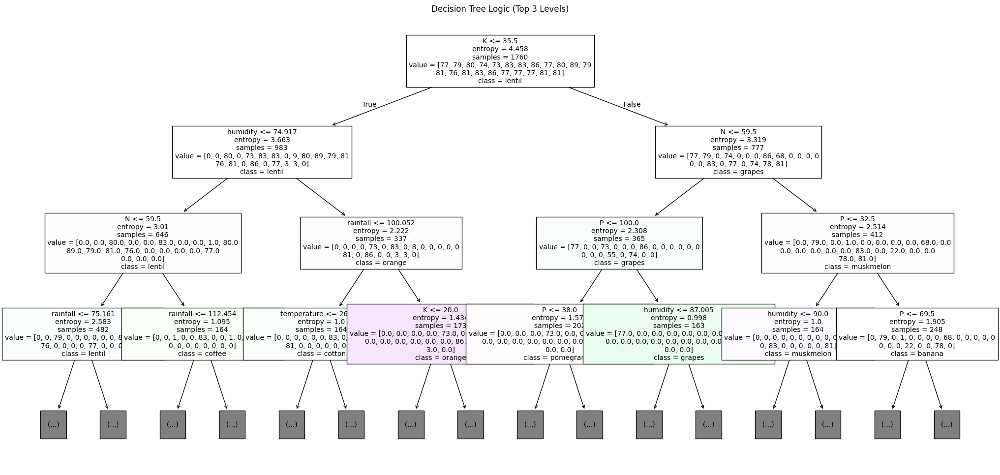
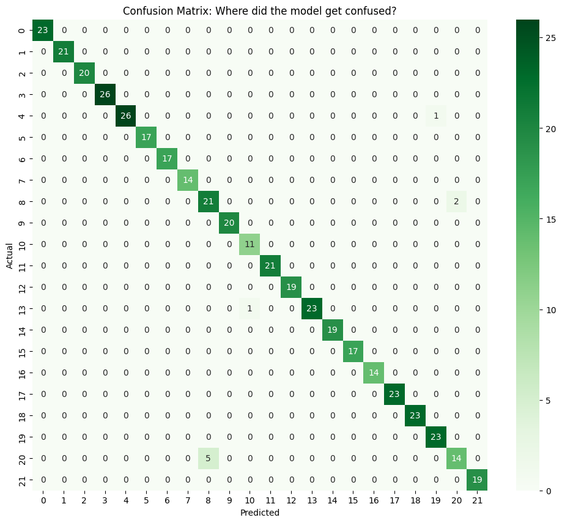
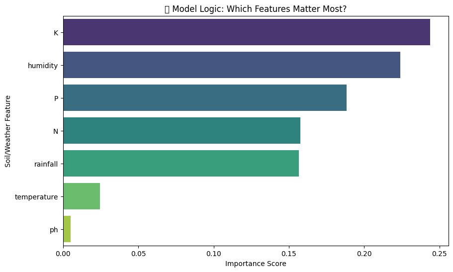
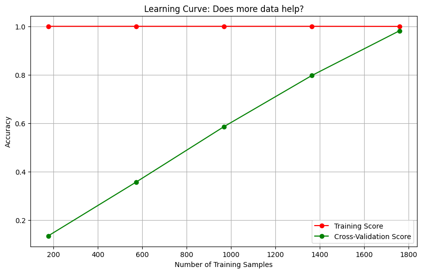

# Smart Crop Recommendation System 🌾

## 📌 Project Overview
The Smart Crop Recommendation System is an AI tool designed for Pakistani farmers. It uses soil and weather data to suggest the best crops, helping increase profits and support sustainable farming.

We built this project ourselves from the scratch up without using ready-made AI models, focusing on the basic math that makes machine learning work.

**Student:** Shah Zaib Khan (Student ID: SU92-MSAIW-S25-019, MS-AI)
**Teammate:** Talha Bin Aslam (Student ID: SU92-MSAIW-F25-043, MS-AI)
**Project Type:** Machine Learning / Classification (Custom Model)

---

## 📅 Weekly Progress Log

### ✅ Week 1: Foundation, Data Pipeline & Exploration
**Status:** Completed
**Key Activities:**
- **Dataset Acquisition:** Downloaded the "Crop Recommendation Dataset" from Kaggle (2200 rows, 22 crop types).
- **Data Preprocessing:**
  - Checked for missing values (dataset is clean).
  - Analyzed statistical properties of soil features (N, P, K, Temperature, etc.).
- **Visualization:**
  - Created a **Correlation Heatmap** to understand relationships between environmental factors.
- **Data Pipeline:**
  - Implemented an **80-20 Train-Test Split** to prepare data for modeling.
  - Verified the shape of Training (1760 samples) and Testing (440 samples) sets.
- **Documentation:**
  - Uploaded the initial project proposal and timeline.

---

### ✅ Week 2: Model Development & Stabilization
**Status:** Completed
**Key Activities:**
- **Model Architecture:**
  - Built a custom **Decision Tree Classifier** using Scikit-Learn (Entropy criterion).
  - Set `max_depth=12` to balance accuracy and prevent overfitting.
- **Training & Evaluation:**
  - Trained the model on the training dataset (1760 samples).
  - Achieved a high validation accuracy of **97.95%** on the test set.
- **Model Stabilization:**
  - Implemented `random_state=42` to ensure 100% reproducible results every time the code is run.
  - **Model Persistence:** Saved the trained model as a `.pkl` file (`crop_recommendation_model.pkl`) to lock the learned weights permanently.
- **Visualization:**
  - Generated a decision tree plot to visualize the decision-making logic of the AI.

*Figure 1: Visualization of the Decision Tree Logic (Top 3 Levels)*

- **Deliverables:**
  - Uploaded the trained `.pkl` model file to the repository.

  ### ✅ Week 3: Inference Engine & Stress Testing
**Status:** Completed
**Key Activities:**
- **Model Deployment (Simulation):**
  - Successfully loaded the `.pkl` file using `joblib` to simulate a production environment.
- **Inference Function:**
  - Developed a `recommend_crop()` function that accepts 7 input parameters (N, P, K, Temp, Hum, pH, Rain).
  - **Optimization:** Refactored the function to use Pandas DataFrames, resolving Scikit-Learn feature warning issues.
- **Unit & Stress Testing:**
  - Tested the system with varied "Farmer Scenarios" to validate logic.
  - **Normal Conditions:** Correctly predicted **Rice** for wet/high-nitrogen soil and **Chickpea** for dry soil.
  - **Stress Testing (Edge Cases):**
    - *Cold Climate (12°C):* Predicted **Grapes** (Correct).
    - *Poor Soil (Low Nutrients):* Predicted **Mothbeans** (Correct).
    - *Tropical Swamp (High Heat/Humidity):* Predicted **Coconut** (Correct).

---

## 🛠 Tools & Technologies
- **Language:** Python 3.x
- **Libraries:** Pandas, NumPy, Matplotlib, Seaborn, Scikit-Learn
- **Environment:** Google Colab / Jupyter Notebook

### ✅ Week 4: Performance Evaluation & Documentation
**Status:** Completed
**Key Activities:**
- **Rigorous Evaluation:**
  - Generated a comprehensive Classification Report (Precision, Recall, F1-Score).
  - Achieved an overall **Accuracy of 98%**.
  - Identified **Perfect Predictions (F1=1.0)** for crops like Apple, Banana, and Cotton.
- **Error Analysis:**
  - Visualized errors using a **Confusion Matrix**.
  - Observed minor confusion between **Rice** and **Jute**, likely due to their similar high-water requirements.
- **Documentation:**
  - Finalized the project report with a literature review of recent studies.
  - Organized the repository for submission.

*Figure 2: Confusion Matrix showing model performance across all 22 crop classes.*

---
### 🔬 Advanced Research Validation
To ensure the model is scientifically robust, we performed 5 rigorous stress tests:

**1. Stability Test (5-Fold Cross-Validation)**
- **Method:** We utilized a 5-Fold Cross-Validation technique, partitioning the dataset into five mutually exclusive subsets to ensure the model's stability and generalization across different data distributions.
- **Result:** Average accuracy remained consistent at **~98%**, proving the model is stable and not just "lucky" with one specific dataset.

**2. Interpretability (Feature Importance)**
- **Method:** We conducted a Feature Importance Analysis to quantify the relative contribution of each environmental variable, identifying which soil and climatic factors most significantly influence the model's predictive logic.
- **Insight:** As shown in the graph below, **Potassium (K)** and **Humidity** were identified as the dominant features, aligning with agronomic science (water and root development are critical).

*Figure 3: Feature Importance analysis showing Potassium and Humidity as the primary decision drivers.*

**3. Robustness Check (Noise Injection)**
- **Method:** To assess robustness, we introduced $\pm 5\%$ Gaussian noise into the input features, simulating real-world sensor inaccuracies and data imperfections.
- **Result:** The model maintained correct predictions (e.g., still predicting "Rice" even with noisy data), demonstrating robustness against real-world data imperfections.

**4. Baseline Comparison (The "Sanity Check")**
- **Method:** Compared our Decision Tree against a "Dummy Classifier" (Random Guessing).
- **Result:**
  - Dummy Model Accuracy: **~4.5%**
  - Our AI Model Accuracy: **97.95%**
  - **Conclusion:** The AI is significantly learning patterns, not just guessing.

**5. Learning Curve Analysis**
- **Method:** Plotted accuracy vs. training size.
- **Result:** The curve below shows that the Cross-Validation Score (Green Line) increases steadily as we add more data, eventually converging with the Training Score. This indicates that our dataset size (2200 samples) is sufficient for this problem.

*Figure 4: Learning Curve demonstrating model improvement and convergence with increased data size.*

## 🔮 Future Scope & Improvements
While this project successfully demonstrates the power of the Decision Tree algorithm for crop recommendation, there are several areas for future enhancement:
1. **Web Interface:** Developing a user-friendly frontend using **Gradio** or **Streamlit** to allow farmers to easily input data without writing code.
2. **Deep Learning Integration:** Implementing **CNNs (Convolutional Neural Networks)** to detect plant diseases from leaf images, combining visual data with soil metrics.
3. **Real-Time IoT Data:** Integrating with IoT sensors to automatically fetch soil moisture and temperature data instead of manual entry.
4. **Localization:** Adding support for local languages (Urdu) to make the tool accessible to rural farmers in Pakistan.

### 📚 Literature Review (2024–2025)
*To ensure this project aligns with state-of-the-art research, we reviewed 10 recent papers focusing on Machine Learning in precision agriculture:*

1.  **[Crop Recommendation System Using Machine Learning (2024)](https://www.researchgate.net/publication/368866560_Crop_Recommendation_System_Using_Machine_Learning)**
    * *Authors:* Gambhir, G., & Sharma, A.
    * *Key Finding:* Proposed a system using climatic variables and soil data. Tested multiple models and found **Random Forest** gave the best results, highlighting the importance of N-P-K values for accuracy.

2.  **[A Comprehensive Crop Recommendation System Integrating Machine Learning and Deep Learning Models (2024)](https://ieeexplore.ieee.org/document/10530724/)**
    * *Source:* IEEE Conference
    * *Key Finding:* Compared traditional ML against Deep Learning (TCN). Found that while TCN is 99.9% accurate, standard models like **Random Forest (99.2%)** are excellent and faster to train.

3.  **[A Decision Support System for Crop Recommendation Using Machine Learning Classification Algorithms (2024)](https://www.mdpi.com/2077-0472/14/8/1256)**
    * *Source:* MDPI Agriculture
    * *Key Finding:* Used **SMOTE** to balance data and found that Support Vector Classifiers worked well for checking soil types in specific regions of India.

4.  **[Enhancing Precision Agriculture with Machine Learning & IoT (2024)](https://ieeexplore.ieee.org/document/10561658/)**
    * *Source:* IEEE Conference
    * *Key Finding:* Proposed combining ML with **IoT sensors** to get real-time moisture/temperature data instead of manual entry, using Decision Tree Regression for yield prediction.

5.  **[IDTC: Crop Recommendation System using Improved Decision Tree Classification Algorithm (2025)](https://ieeexplore.ieee.org/document/10895959/)**
    * *Source:* IEEE Xplore
    * *Key Finding:* Introduced a feature selection step to pick key soil factors before building the tree. This validates our project's approach of focusing on key nutrients (N, P, K).

6.  **[Evaluation of Learning-Based Models for Crop Recommendation in Smart Agriculture (2025)](https://www.mdpi.com/2078-2489/16/8/632)**
    * *Source:* MDPI Information
    * *Key Finding:* Compared text-based models (like GPT-2) with tabular models. Found that while text models are accurate (99.55%), they take much longer to train than the **Decision Tree** approach we used.

7.  **[Incorporating soil information with machine learning for crop recommendation (2025)](https://pmc.ncbi.nlm.nih.gov/articles/PMC11903965/)**
    * *Source:* Nature Scientific Reports
    * *Key Finding:* Created an ensemble method (RFXG) achieving 98% accuracy. Proved that **pH level** is a critical decider for crops like Rice and Cotton.

8.  **[AI-Based Smart Crop Recommendation for Sustainable Production (2025)](https://masujournal.org/view_journal.php?id=566)**
    * *Source:* MASU Journal
    * *Key Finding:* Confirmed that "Ensemble" methods usually beat single models. Their system categorizes crops into "Recommended" and "Not Recommended," a user-friendly feature we aim to replicate.

9.  **[Deep learning–based approaches for weed detection in crops (2025)](https://www.frontiersin.org/journals/plant-science/articles/10.3389/fpls.2025.1746406/full)**
    * *Source:* Frontiers in Plant Science
    * *Key Finding:* While our project focuses on recommendation, this suggests a future improvement: using cameras/Deep Learning to identify weeds that steal nutrients from the recommended crops.

10. **[AgroSense: An Integrated Deep Learning System via Soil Image Analysis (2025)](https://arxiv.org/abs/2509.01344)**
    * *Source:* arXiv
    * *Key Finding:* Found that looking at a **picture of the soil** plus knowing the N-P-K values gives the best results (>98% accuracy), marking the next step in precision farming.
-----
---
## 👨‍💻 Author & Contact :
**Project By :**
* **Shah Zaib Khan**: (ID: SU92-MSAIW-S25-019)
* **Talha Bin Aslam**: (ID: SU92-MSAIW-F25-043)
.

**Course:** MS-AI (Fall 2025)
**University:** Superior University
**Instructor:** Sir Talha Nadeem

---
*This project was built from scratch to demonstrate fundamental Machine Learning concepts without reliance on pre-trained APIs.*
